<p align="center">
  
</p>

<h1 align="center">Subbuteo Scoreboard</h1>

<p align="center">
  A desktop scoreboard for Subbuteo (table football) matches, inspired by the classic Subbuteo box.<br />
  Tap to score, run the half-time clock and keep a history of every match.
</p>

<p align="center">
  
  
  
  
  
  
  
  
  <br />
  
  
  
  
</p>

---

## Features

- **Giant tap-to-score counters.** Tap the top half of a score to add a goal, the bottom half to take one away. Keyboard shortcuts work too (`Q`/`A` for player 1, `P`/`L` for player 2).
- **Half-time clock.** A countdown for each half with a clear 1st / 2nd half indicator, plus pause, resume, restart-half and end-match controls. When a half runs out, the clock stops at zero and waits for you to start the next one.
- **Match setup.** Pick each team from a fish-eye carousel (PES/FIFA style), enter the player names, choose the length of each half and, if you like, give one side a head start.
- **Match history and standings.** Every finished match is saved with its date, time, teams, players and score. A player table ranks wins, draws, losses and goal difference. History can be exported to CSV.
- **Sound.** A real referee's whistle for kick-off, pause and full time, cheering from the stands on every goal, and background music played in random order. The top-right corner holds the language selector and the full-screen, mute and quit buttons. Quitting during a match asks for confirmation first.
- **Customisable.** Add your own teams and crests, change the preset match lengths, replace any sound effect and build your own music playlist.
- **Four languages.** Castellano, Català, English and Italiano, switchable at any time from the flag selector, with a default language for startup.
- **Lively, not flashy.** Screens fade between each other and their elements enter in sequence: the logo drops in, the "Subbuteo Scoreboard" title rises and its side rules open out, and goals, half time and the final result each get their own animation. It all switches off when macOS **Reduce motion** is on.
- **Made for full screen.** It opens full screen behind two splash screens, Ariane webdesign and then the Subbuteo logo with the app title, in under 5 seconds in total, and keeps the display awake during a match. The layout is designed for a 14" MacBook Pro.

## Tech stack

| Area | Technology |
|---|---|
| Desktop shell | [Electron](https://www.electronjs.org/) with a sandboxed renderer and a `contextBridge` preload |
| Build | [electron-vite](https://electron-vite.org/) (Vite 7) and [electron-builder](https://www.electron.build/) |
| UI | Vanilla JavaScript (ES modules), no framework |
| Styles | SCSS plus [Tailwind CSS 4](https://tailwindcss.com/), with an empty `custom-styles.scss` for quick overrides |
| Carousel | [SplideJS 4](https://splidejs.com/) |
| Animations | [animate.css 4](https://animate.style/), with subtler entrance keyframes (`styles/animations.css`) |
| Audio | Web Audio API for sound effects, `HTMLAudioElement` for the music playlist |
| Fonts | Barlow, Barlow Condensed and Anton (bundled with Fontsource, so they work offline) |
| Storage | A local JSON file in the user data folder, written atomically |

## Getting started

You need Node.js 20 or later.

```bash
npm install
npm run dev
```

If the Electron binary didn't download during install, run `node node_modules/electron/install.js` once.

### Scripts

| Command | Description |
|---|---|
| `npm run dev` | Start the app in development mode with hot reload |
| `npm run build` | Build the main, preload and renderer bundles into `out/` |
| `npm run preview` | Run the production build without packaging it |
| `npm run dist:mac` | Build a `.dmg` installer in `dist/` |
| `npm run dist:win` | Build a Windows installer (NSIS) |
| `npm run dist:linux` | Build a Linux AppImage |

## Installing on macOS

1. Run `npm run dist:mac` and open the `.dmg` it creates in `dist/`.
2. Drag **Subbuteo Scoreboard** into **Applications**.
3. The app isn't signed with an Apple Developer certificate, so the first time you open it, right-click it and choose **Open → Open**. You can also allow it from **System Settings → Privacy & Security**.
4. To keep it handy, right-click its Dock icon and choose **Options → Keep in Dock**. To put it on the desktop, drag it from Applications while holding **⌥ Option + ⌘ Command**, which creates an alias.

Your history and settings are stored outside the app bundle, so they survive reinstalls and updates.

## Project structure

```
src/
  main/              Main process: window, IPC, media:// protocol
    store.js         JSON persistence (app-data.json in the data folder)
  preload/           Secure window.api bridge between renderer and main
  shared/            Default teams and durations, crest generator for teams without an image
  renderer/
    index.html       Single window, including the two splash screens as an overlay
    public/
      crests/        Team crests (SVG)
      flags/         Flags for the language selector
      images/        Subbuteo and Ariane webdesign logos
      music/         Default background music
    src/
      core/          State, router, audio engine, icons, utilities
      components/    Top bar, language menu, team carousel, modals, toasts
      views/         home, setup, match, history, settings
      i18n/          Translations: es.js, ca.js, en.js, it.js
      assets/        Bundled sound effects and pitch lines
      styles/        tailwind.css, SCSS partials and custom-styles.scss
docs/                README logo and screenshots
```

## Customisation

### App icon

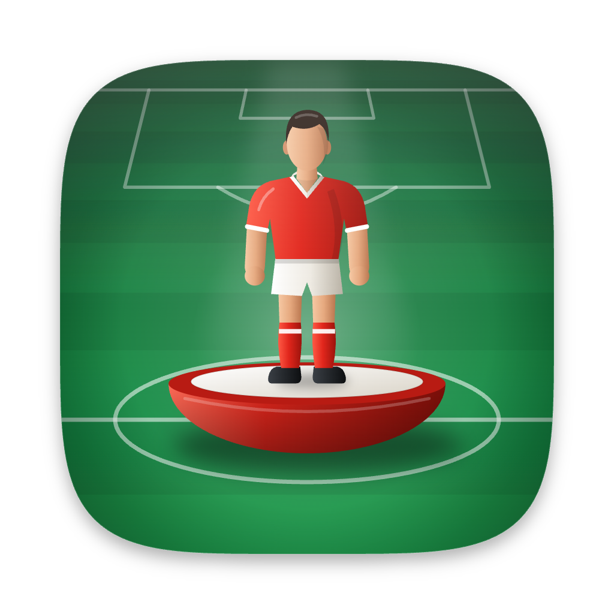

The icon is an original illustration: a hand-painted Subbuteo figure on its base, standing on the centre spot of a pitch seen in perspective, under a stadium floodlight. The editable source is `build/icon.svg`. electron-builder uses `build/icon.icns` for macOS and `build/icon.png` (1024 × 1024) for Windows and Linux. To regenerate the `.icns` after editing the SVG, export a 1024 px PNG and run `iconutil` on an `.iconset` with the 16–512 px sizes at @1x and @2x.

### Teams and crests

The default teams live in `src/shared/defaults.js` and their crests in `src/renderer/public/crests/<team-id>.svg`. You can also add teams, upload crests or restore the originals from **Settings → Teams**. A team added without a crest gets one generated from its two colours.

### Sounds and music

- The whistle and goal sounds are bundled in `src/renderer/src/assets/sounds/`. You can replace them from **Settings → Sounds**.
- The default background music is every audio file in `src/renderer/public/music/`. It plays in random order until you add your own tracks in **Settings → Music**, which then replace it. Track titles come from the file names (`author-track-title-123456.mp3` becomes "Track Title · author").
- Imported files are copied into the app's data folder and served through a private `media://` protocol.

### Languages

Use the flag selector in the top bar to switch language for the current session. Set the startup language in **Settings → General**. To add a language, create `src/renderer/src/i18n/<code>.js` with the same keys as `es.js` and register it in `i18n/index.js`.

### Styles

- Theme tokens (colours and fonts) are defined in the `@theme` block of `styles/tailwind.css`.
- The SCSS partials sit inside `@layer components`, so Tailwind utilities can override them.
- `styles/custom-styles.scss` loads last, outside any layer. It's empty and meant for quick fixes.

## Data

Match history and settings are stored in:

| OS | Location |
|---|---|
| macOS | `~/Library/Application Support/Subbuteo Scoreboard/app-data.json` |
| Windows | `%APPDATA%\Subbuteo Scoreboard\app-data.json` |
| Linux | `~/.config/Subbuteo Scoreboard/app-data.json` |

Files you import (crests, sounds and music) are copied into a `media` folder next to it. Data from earlier versions, stored under `Subbuteo Marcador/subbuteo-data.json`, is copied over automatically on first launch.

## Credits

Designed and developed by **Joan Galtés i Moreno** ([joan@arianewebdesign.com](mailto:joan@arianewebdesign.com)) at [Ariane webdesign](https://arianewebdesign.com).

See [CREDITS.md](CREDITS.md) for the source and licence of every sound, track, crest and logo. Team crests and the Subbuteo logo are trademarks of their respective owners and are used here for identification only.

Developed with ♥ in Arenys de Munt.

## Gallery

<table>
  <tr>
    <td width="50%">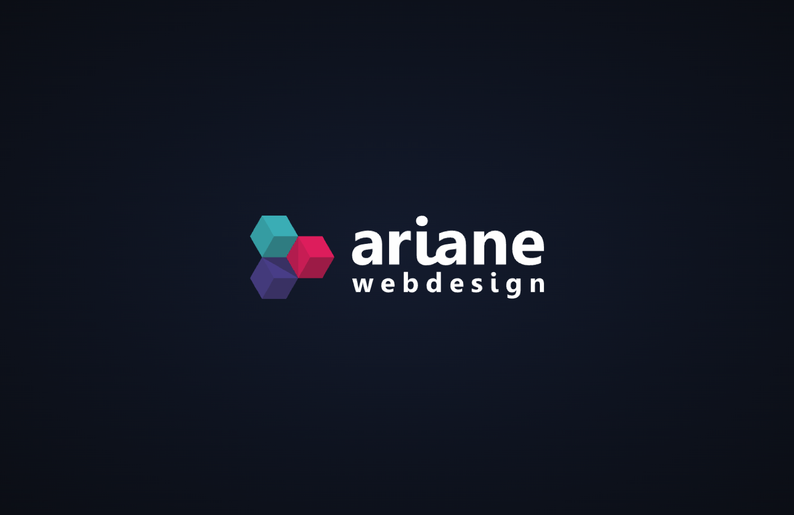<p align="center"><sub>Splash: Ariane webdesign</sub></p></td>
    <td width="50%">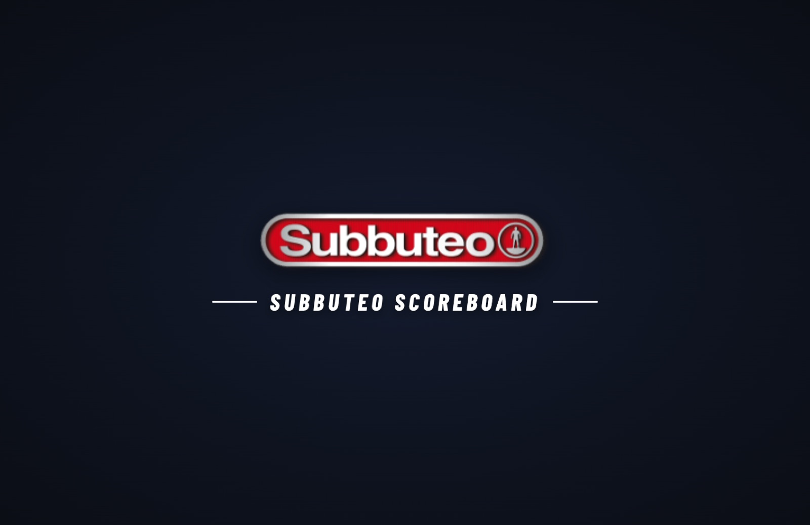<p align="center"><sub>Splash: Subbuteo Scoreboard</sub></p></td>
  </tr>
  <tr>
    <td colspan="2">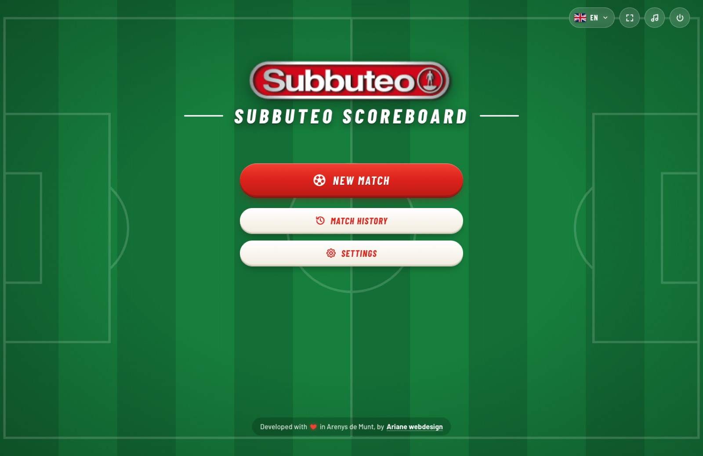<p align="center"><sub>Home</sub></p></td>
  </tr>
  <tr>
    <td>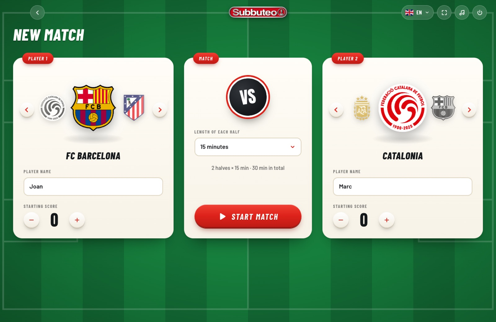<p align="center"><sub>New match: fish-eye team carousels</sub></p></td>
    <td>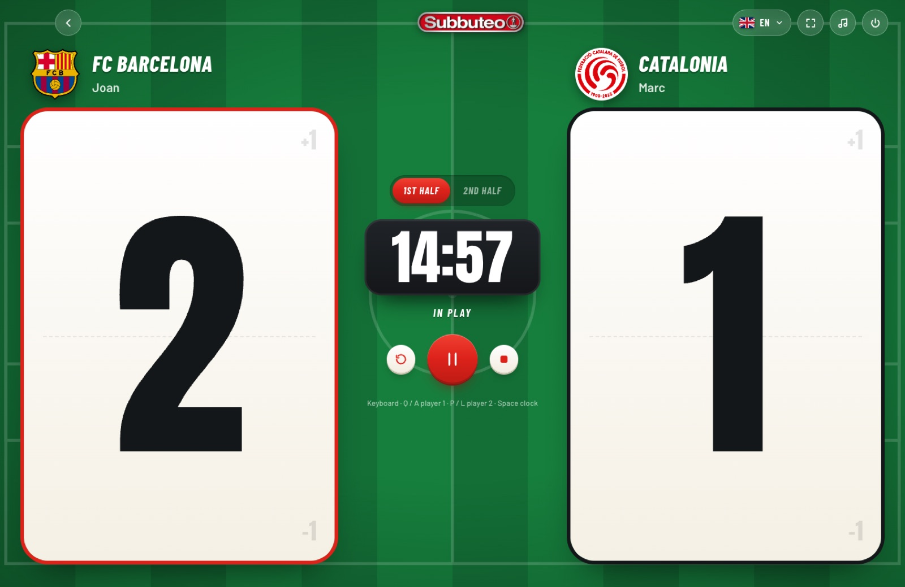<p align="center"><sub>Match: giant scores and half-time clock</sub></p></td>
  </tr>
  <tr>
    <td>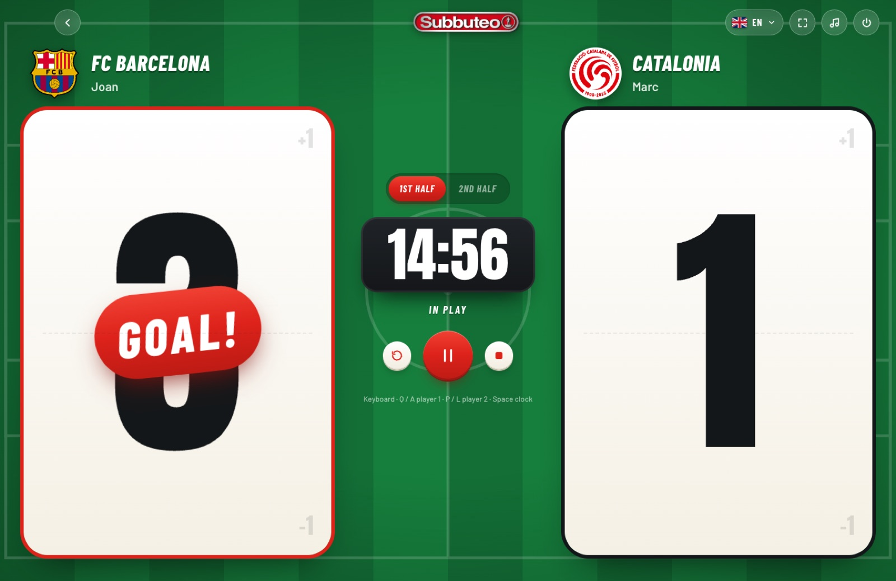<p align="center"><sub>Goal!</sub></p></td>
    <td>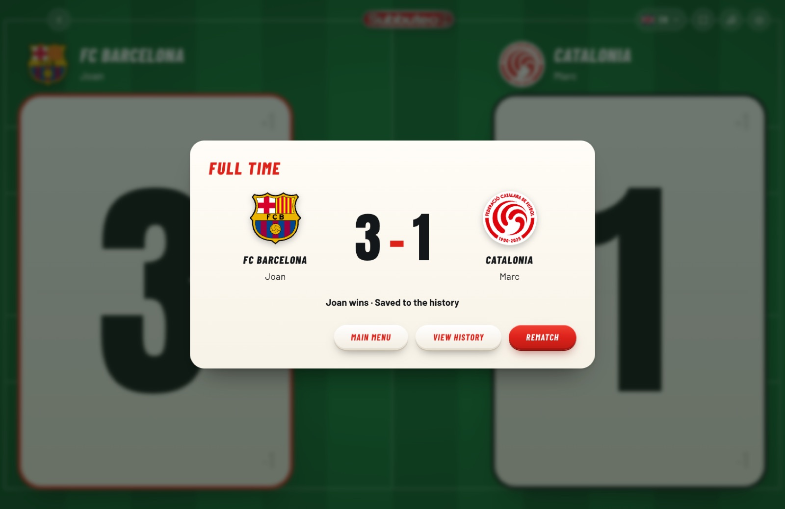<p align="center"><sub>Full time</sub></p></td>
  </tr>
  <tr>
    <td>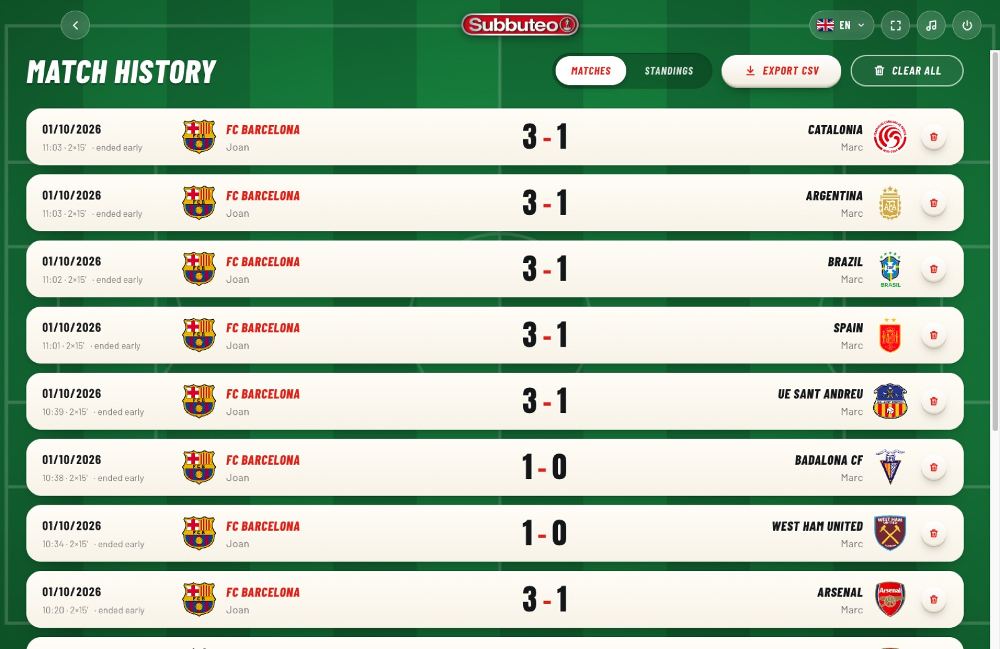<p align="center"><sub>Match history</sub></p></td>
    <td>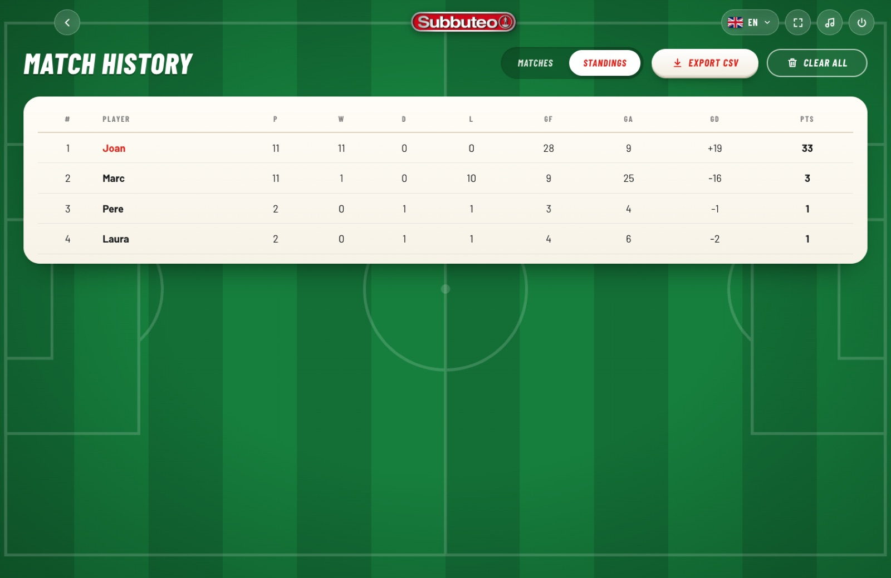<p align="center"><sub>Player standings</sub></p></td>
  </tr>
  <tr>
    <td>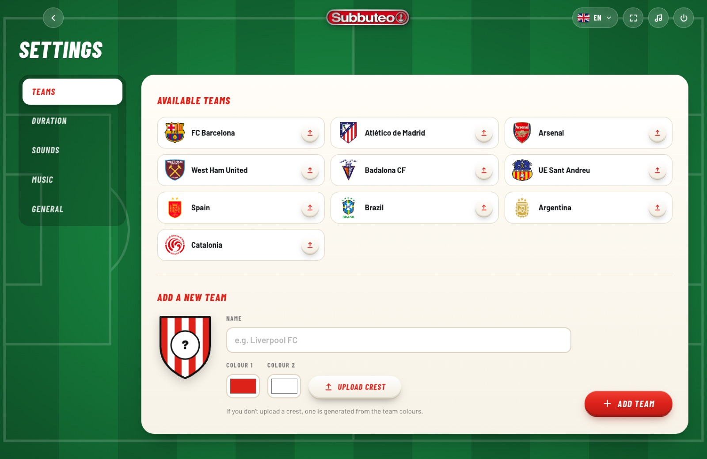<p align="center"><sub>Settings: teams and crests</sub></p></td>
    <td>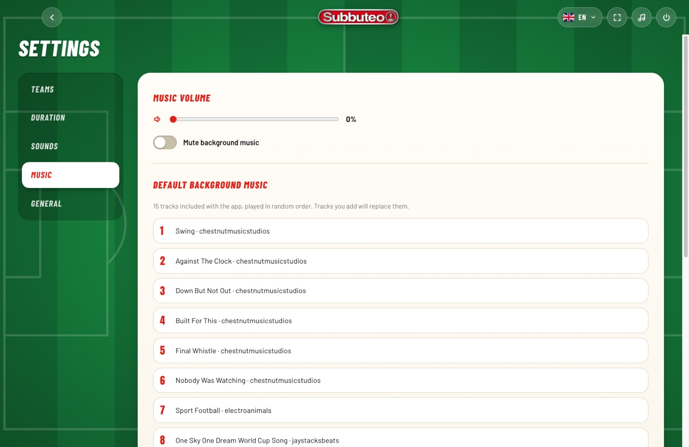<p align="center"><sub>Settings: background music</sub></p></td>
  </tr>
  <tr>
    <td>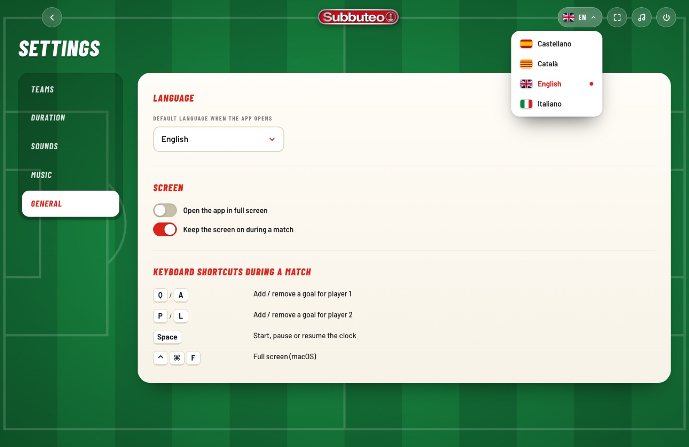<p align="center"><sub>Language selector</sub></p></td>
    <td></td>
  </tr>
</table>
